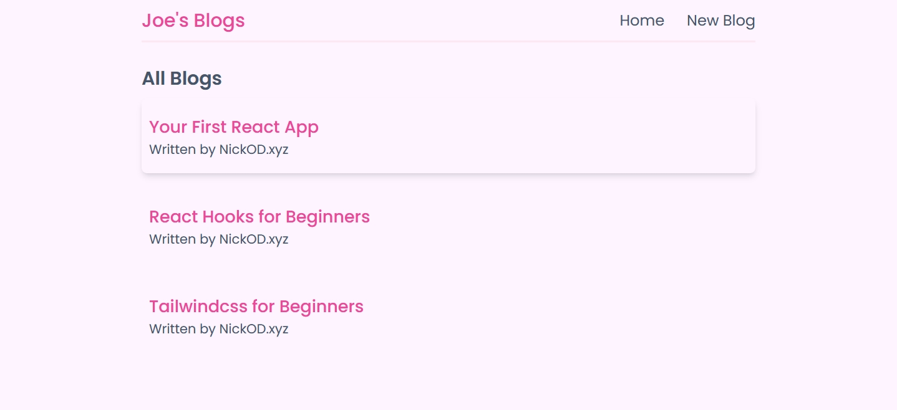

<h1 align="center">React Blog YT Tutorial | NickOD.xyz</h1>

 

## Overview

Following The Net Ninja's youtube tutorial for creating a react blog app.

[The Net Ninja - YT Tutorial](https://www.youtube.com/playlist?list=PL4cUxeGkcC9gZD-Tvwfod2gaISzfRiP9d)

 

## Installation & Running

npm install

- Installs all needed dependencies

npm run dev

- Run the app on your local server

 

## Link to Live Site

[Coming Soon...]()

 

## Sticking Points & What I learned

react-router-dom

- This was the first time I've used the react-router-dom, so it was good to get an understanding of how to use Router, Switch and Route. Along with pointing to the paths needed.

Reusable Custom Hook

- This was my first custom hook as well. While it may not do much in the grand scheme of things it was good to learn how to create one and import it into the components that would need to use it.

Conditional Rendering

- I found this a very useful trick. I will definitelya be mindful of using this in future projects.

useParams

- I've used this technique before when learning Ruby on Rails so it wasn't completely new to me. But none the less was good to see it in practice and understand how to use it in React.

## Author

- Website - [NickOD.xyz](http://www.NickOD.xyz)
- My LinkedIn - [LinkedIn](https://www.linkedin.com/in/nick-odonoghue/)

 

## Useful Resources

[React Docs](https://react.dev/learn)

 

## Acknowledgments

[Le Wagon](https://www.lewagon.com/) & all the teachers, TAs and classmates from <em>1122</em>

[The Net Ninja YT](https://www.youtube.com/@NetNinja)

[The Net Ninja](https://netninja.dev/)
